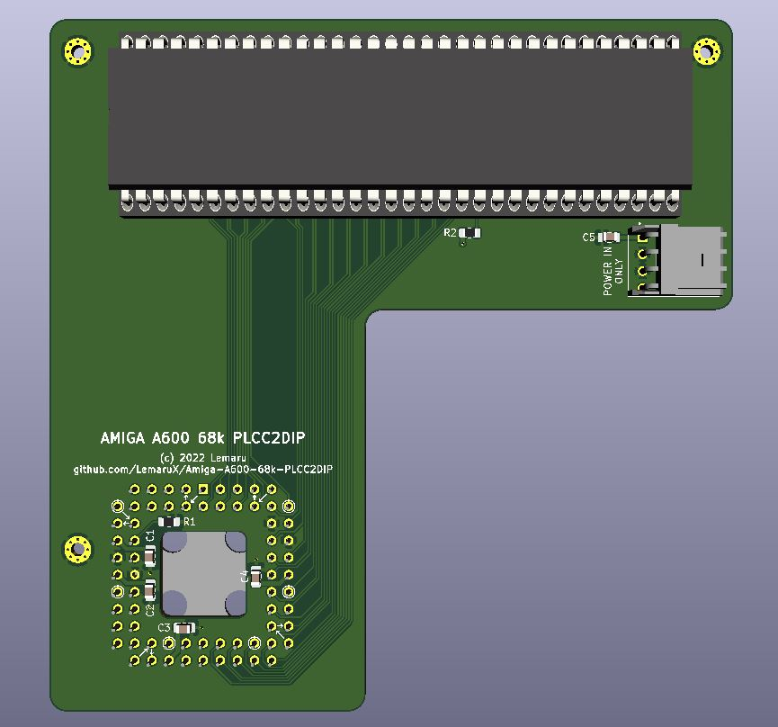

# Amiga-A600-68k-PLCC2DIP
 This is a simple adaptor to allow the use of 64pin DIP CPU's and accelerators on an Amiga 600

---

## Summary
This is a basic adaptor that disables the on-board 68000 on an Amiga 600, and provides a 64pin DIP socket to allow you to connect a 64pin CPU or an A500 accelerator card. It is based on an idea by [Kludge](https://gitlab.com/kludge) and a modified version of his [Ice Scraper](https://gitlab.com/kludge/a600-ice-scraper) breakout board. 

**Rev B Update** - The board has now been updated to a 4-layer design. It also includes a floppy power connector to provide additional power. **DO NOT use this connector for powering any devices, it is ONLY for providing additional power to the adaptor. ONLY apply power from the same power source that is powering the Amiga (E.g. the floppy power connector). DO NOT USE AN EXTERNAL POWER SUPPLY.** 

To date it has only been tested successfully with the devices listed below. If anyone tests the adaptor successfully on another device, then please let me know and I can update the list.

- 68010 CPU
- 68000 CPU
- Terriblefire TF536 (This requires a specific firmware to work on the A600 which you can find [here](https://www.exxoshost.co.uk/forum/viewtopic.php?f=93&t=3438))
- Matzes 68EC020TK card (Although this device is reported to work, it is too large to close the A600 case when fitted)

- PiStorm - **NOTE** The PiStorm board has been tested, however the A600 is currently not fully supported with the current Proto3 CPLD firmware. 

**PLEASE NOTE** If using with a Terriblefire 536 in the Amiga 600, you must use a certain revision [firmware](https://www.exxoshost.co.uk/forum/viewtopic.php?f=93&t=3438). Unfortunately due to the size of the TF536, to allow for it to fit inside the A600 and the case to be fully closed, you must solder the 64pin DIP socket (or pin strip) with the upper most row of pins slightly higher than the bottom row. This allows the TF536 to sit at a slight angle and prevents it from hitting the bottom of the keyboard. The top row does not need to be raised by much, I usually solder the socket with the top row of pins flush with the bottom of the PCB, which makes it sit approximately 2mm higher. You can find an example of this below:

   

Devices that have been tested and do **NOT** work are listed below. Again, please let me know when you find devices that do not work so the list can be updated. 

- Terriblefire TF534

---

## Bill Of Materials

| Ref | Value | Footprint | Notes |
| ----------- | ----------- | ----------- | ----------- |
| U1 |  | PLCC68 Socket| A good quality socket such as an Augat PCS-068A is desirable. For a better fit on the A600 CPU, please modify the socket as per the instructions [here](PLCC-Rework.md) |
| U2 |  | DIP64 Socket | |
| R1 | 220R | 0805 | |
| R2 | 1k | 0805 | |
| C1, C2, C3, C4, C5 | 100nf | 0805 | |
| J1 |  | 171826-4 | TE Connectivity floppy power header |

---

## Mounting

To achieve the best fit on the A600 CPU, please use a good quality PLCC socket with strong pins (such as the Augat PCS-068A, which is discontinued but can still be found online). As the PLCC socket is being used in a way that it is not intended, please follow the instructions [here](PLCC-Rework.md) to modify the socket. This will allow it to grip the on-board 68k better, giving a better connection and preventing it from easily popping off.

There are also three mounting holes, which can be used to attach it to the A600 motherboard using the HDD mounting holes. For this, I use M1.6 x 16mm screws pushed through from underneath the motherboard. Do not tighten the nuts up too much as this can damage either the adaptor or your motherboard. I use 3D printed spacers about 8.3mm in height to support the board (this is based on the height of the PLCC socket after it has been modified), but any spacer the correct size will suffice. I would advise measuring the height of the PLCC socket (after it has been modified accordingly) and using spacers of an equal height. 

I have included the STL files for the spacers that I use in the STL folder. To prevent the nuts coming loose, I use a small dab of nail varnish on the threads once they have been tightened as required. This prevents them from coming loose, but still allows for them to be easily removed. I have also included an STL file for a small thumbscrew part, which you can push the M1.6 nuts into before placing them on the screws. By using these, it is much easier to tighten and remove the nuts if/when required, without the use of any additional tools.

---

## License

Shield: [![CC BY-NC-SA 4.0][cc-by-nc-sa-shield]][cc-by-nc-sa]

This work is licensed under a [Creative Commons Attribution-NonCommercial-ShareAlike 4.0
International License][cc-by-nc-sa].

[![CC BY-NC-SA 4.0][cc-by-nc-sa-image]][cc-by-nc-sa]

[cc-by-nc-sa]: http://creativecommons.org/licenses/by-nc-sa/4.0/
[cc-by-nc-sa-image]: https://licensebuttons.net/l/by-nc-sa/4.0/88x31.png
[cc-by-nc-sa-shield]: https://img.shields.io/badge/License-CC%20BY--NC--SA%204.0-lightgrey.svg

---

## Thanks

- Kludge for the original idea and basic schematic
- 8 Bit Dreams and alenppc for testing the board
- [SukkoPera](https://github.com/SukkoPera) for the upside down PLCC socket as used in his excellent [A600 FastRAM expansion](https://github.com/SukkoPera/OpenAmiga600FastRamExpansion)
- Terriblefire for the TF536, which was the sole reason I made this as I wanted to stick one in my A600
